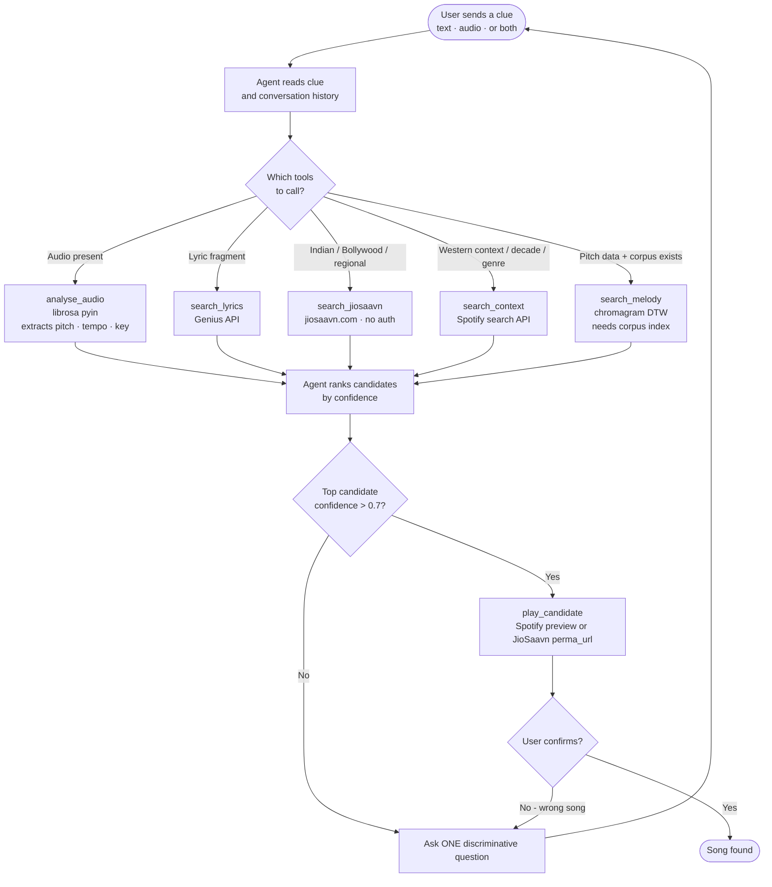

# How Mnemo Works

The agent (Claude) decides which tools to call each turn based on what the user said. There is no fixed routing - it reasons over the clues and picks the most useful search.

**Working now:** audio analysis, Genius lyrics search, JioSaavn Indian song search, Spotify context search.

**Needs setup:** Spotify preview playback needs `SPOTIFY_CLIENT_ID` and `SPOTIFY_CLIENT_SECRET` in `.env`. Melody search needs a local corpus index built first - see README.
