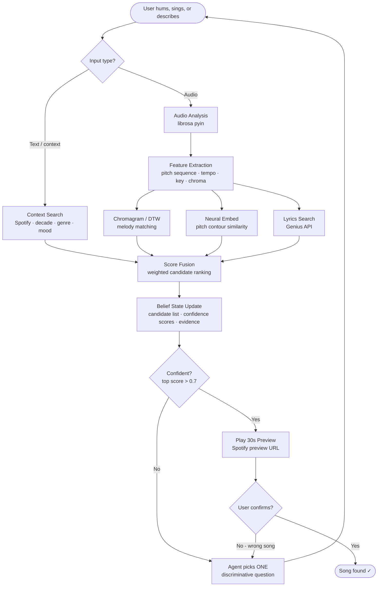

# How Mnemo Works

```mermaid
flowchart TD
    A([User hums, sings, or describes]) --> B{Input type?}

    B -->|Audio| C[Audio Analysis\nlibrosa pyin]
    B -->|Text / context| G

    C --> D[Feature Extraction\npitch sequence · tempo · key · chroma]

    D --> E1[Chromagram / DTW\nmelody matching]
    D --> E2[Neural Embed\npitch contour similarity]
    D --> E3[Lyrics Search\nGenius API]

    G[Context Search\nSpotify · decade · genre · mood] --> F

    E1 --> F[Score Fusion\nweighted candidate ranking]
    E2 --> F
    E3 --> F

    F --> H[Belief State Update\ncandidate list · confidence scores · evidence]

    H --> I{Confident?\ntop score > 0.7}

    I -->|No| J[Agent picks ONE\ndiscriminative question]
    J --> A

    I -->|Yes| K[Play 30s Preview\nSpotify preview URL]
    K --> L{User confirms?}
    L -->|No - wrong song| J
    L -->|Yes| M([Song found ✓])
```
