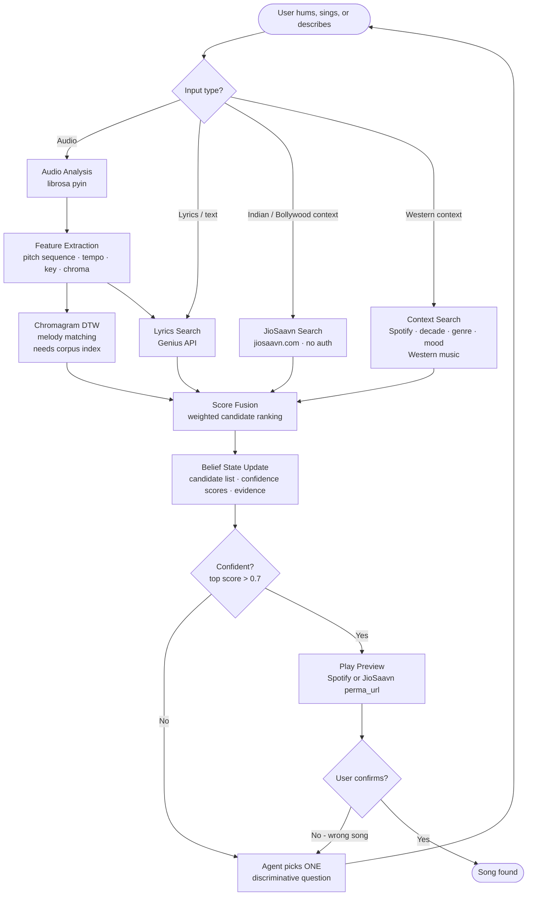

# How Mnemo Works

**What's wired:** Genius lyrics search, JioSaavn Indian song search, Spotify context search, audio analysis via librosa.

**Still needs setup:** Chromagram DTW melody matching requires a corpus index — see README for build instructions. Spotify preview playback requires `SPOTIFY_CLIENT_ID` and `SPOTIFY_CLIENT_SECRET` in `.env`.
